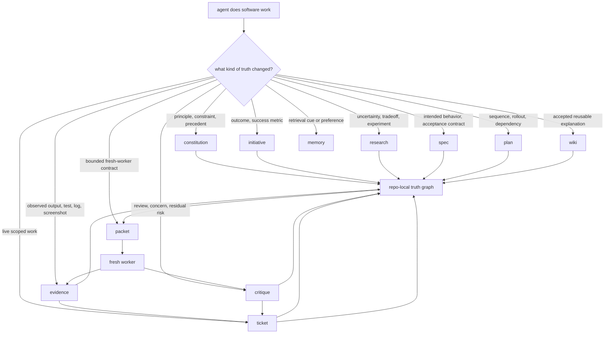

# Agent Loom

Treat your coding-agent sessions like cattle, not pets.


**Agent Loom makes the repo remember.**

Loom is a Markdown-native context-integrity protocol for long-running AI software work.

It teaches coding agents where each shape of engineering context belongs: principles, product intent, research, specs, plans, tickets, evidence, critique, reusable knowledge, and bounded handoff packets. Those records use templates, frontmatter, stable IDs, typed links, and status fields so the agent has to reason about what changed before it writes it down.

Once installed, Loom is meant to feel ambient. The skills encourage the agent to place durable context while normal coding work is happening.

The result is simple: the active chat can end, compact, switch models, switch harnesses, or fan out to fresh workers without becoming the only place the project knows what happened.

**The worker is disposable. The graph compounds.**

[Install Loom](INSTALL.md) · [Read the protocol](PROTOCOL.md) · [Architecture notes](ARCHITECTURE.md)

---

## Quick Navigation

| If you want to know... | Start here |
| --- | --- |
| What Loom is in one screen | [The aha](#the-aha) · [What you get](#what-you-get) · [Protocol in one screen](#protocol-in-one-screen) |
| Why agent work needs this | [The problem](#the-problem) · [Why this is not just memory](#why-this-is-not-just-memory) |
| How to try it quickly | [Try the cattle-not-pets demo](#try-the-cattle-not-pets-demo) |
| How to install it | [Install](#install) · [INSTALL.md](INSTALL.md) |
| How records and skills fit together | [How Loom works](#how-loom-works) · [Project layers](#project-layers) |
| How long-horizon work works | [Tickets, packets, and fresh workers](#tickets-packets-and-fresh-workers) · [Fan-out and multiday work](#fan-out-and-multiday-work) |
| How Loom decides work is done | [Done is a property of the graph](#done-is-a-property-of-the-graph) · [Evidence and trust boundaries](#evidence-and-trust-boundaries) |
| How Loom relates to other tools | [Where Loom fits](#where-loom-fits) |
| What ships in this repo | [What ships](#what-ships) · [Skill map](#skill-map) · [Repository layout](#repository-layout) |

<details>
<summary>Full table of contents</summary>

- [The aha](#the-aha)
- [What you get](#what-you-get)
- [The problem](#the-problem)
- [What Loom changes](#what-loom-changes)
- [Protocol in one screen](#protocol-in-one-screen)
- [Why this is not just memory](#why-this-is-not-just-memory)
- [Try the cattle-not-pets demo](#try-the-cattle-not-pets-demo)
- [Install](#install)
- [When Loom pays rent](#when-loom-pays-rent)
- [How Loom works](#how-loom-works)
- [The core rule](#the-core-rule)
- [Project layers](#project-layers)
- [How agents choose work](#how-agents-choose-work)
- [Templates are reasoning tools](#templates-are-reasoning-tools)
- [Tickets, packets, and fresh workers](#tickets-packets-and-fresh-workers)
- [Fan-out and multiday work](#fan-out-and-multiday-work)
- [Done is a property of the graph](#done-is-a-property-of-the-graph)
- [Evidence and trust boundaries](#evidence-and-trust-boundaries)
- [Example: a bug fix through Loom](#example-a-bug-fix-through-loom)
- [Research is first-class](#research-is-first-class)
- [Workflows emerge from the vocabulary](#workflows-emerge-from-the-vocabulary)
- [Where Loom fits](#where-loom-fits)
- [Markdown, on purpose](#markdown-on-purpose)
- [What ships](#what-ships)
- [Skill map](#skill-map)
- [Repository layout](#repository-layout)
- [Costs](#costs)
- [The point](#the-point)

</details>

---

## The aha

Most AI coding failures are not only code failures.

They are context-integrity failures.

The agent had a conversation, made a plan, found a constraint, ran a test, rejected an approach, fixed a bug, noticed a risk, and maybe wrote a useful explanation. Then that reasoning scattered across chat, scratch files, stale `PLAN.md` sections, tool output, summaries, and the model's fading context window.

The diff survived. The reasoning did not.

Loom starts from a different premise:

> Software work already produces durable objects. Agents get better when those objects have names, owners, templates, and links.

A behavior question belongs in a spec. A root-cause investigation belongs in research. A live unit of work belongs in a ticket. A test run belongs in evidence. A concern belongs in critique. Accepted understanding belongs in wiki. A bounded handoff belongs in a packet.

Once those shapes are explicit, the agent is no longer carrying the whole project in its head. It is working against a repo-local graph that it can read, update, verify, and hand off.

That is Loom: **ambient context integrity for agentic software work.**

---

## What you get

Loom is useful because it connects several things agents already need, but usually handle separately.

| Need | What Loom gives the agent | Why it matters |
| --- | --- | --- |
| Better context | Typed records for intent, constraints, research, specs, tickets, evidence, critique, and knowledge | The agent retrieves the right shape of context instead of rereading a transcript |
| Better reasoning | Templates with explicit sections and status fields | The agent has to expose scope, assumptions, evidence, risk, and closure instead of hand-waving |
| Better handoff | Packets compiled from the graph | A fresh worker gets a bounded contract, not vibes |
| Better auditability | Evidence, critique, links, and acceptance disposition | Future humans and agents can inspect why a claim became accepted |
| Better long-horizon work | Tickets, packets, fan-out, reconciliation, promotion | Multiday work can survive stopped sessions, model switches, and parallel workers |
| Better reuse | Wiki and research promotion | Lessons compound instead of being rediscovered |

The practical benefit is not that Loom writes more Markdown.

The benefit is that the agent gets a place to put the reasoning that normally disappears.

When the next worker asks, “What do we know, why do we believe it, and what should I do next?” the answer is in the repo.

---

## The problem

Every experienced coding-agent user has felt the junk drawer form.

`PLAN.md` becomes the spec, todo list, research log, failed-attempt record, review trail, status update, and handoff summary. A chat transcript becomes weirdly precious because it contains decisions the repo never absorbed. Scratch files multiply. Summaries get shorter and more confident as they get less complete.

Then the session stops.

Or compacts.

Or switches models.

Or moves from Claude Code to Codex, OpenCode, Cursor, Gemini CLI, or another harness.

Or the user wants to fan out work to several fresh agents.

The next worker is forced to infer what is still true.

The model did not just forget.

The project never knew.

---

## What Loom changes

Loom gives the agent a common record form for software work.

Instead of asking one chat to remember everything, Loom teaches the agent to place context into durable Markdown records with:

- one owner for each durable claim
- small templates that expose missing reasoning
- frontmatter for identity, state, and retrieval
- typed links that connect the records into a graph
- evidence records that preserve what was observed
- critique records that preserve what still deserves doubt
- packets that compile the right context for a fresh worker

This does not make the model magically reliable.

It changes the work surface.

The agent now has to ask, again and again:

```text
What kind of truth changed, and where does that truth belong?
```

That question is the protocol doing its job.

---

## Protocol in one screen

Read this as a placement map, not an execution trace.



The important move is not the diagram. It is the discipline underneath it:

```text
project state -> packet -> fresh worker -> evidence/critique -> reconciliation -> promoted learning -> better project state
```

The repo becomes the continuity layer. The chat becomes a working surface.

---

## Why this is not just memory

Memory is retrieval.

Loom is context integrity.

A memory system might help an agent remember that a test failed, that a maintainer prefers a pattern, or that a design decision existed. Loom asks the next question: **what kind of truth is that, who owns it, what evidence supports it, what depends on it, and what is still unresolved?**

That distinction matters because long-running software work needs more than recall. It needs authority.

A future worker should be able to recover:

- what claim is canonical
- where that claim lives
- what evidence supports or challenges it
- what scope is allowed
- what critique remains open
- what ticket is actually live
- what behavior the implementation is supposed to satisfy
- what changed after a worker returned

Loom can use memory as a support surface, but memory does not become shadow truth. If memory disappears, the project records should still tell the truth.

---

## Try the cattle-not-pets demo

The fastest way to understand Loom is to stop protecting one precious session.

1. Start a nontrivial coding-agent task.
2. Let the work cross at least one ambiguity: a behavior question, failed attempt, review concern, research finding, partial implementation, open risk, or test failure.
3. Let the installed Loom skills place durable truth into owner records such as research, specs, tickets, evidence, critique, and wiki. Use packets when a bounded handoff or fresh worker would help.
4. Stop the session: close the chat, compact the context, switch models, switch harnesses, hand the work to another agent, or come back tomorrow.
5. Start from a fresh session and ask for the next step:

```text
Continue the active work from the repo's project records. Do not rely on prior chat context.
```

In a skills-aware harness, you usually should not need magic words. If a cold session does not route automatically, a nudge is fine:

```text
Use loom-bootstrap, then continue from the project records.
```

Without durable records, the new session usually guesses or tries to reconstruct the missing story.

With Loom, it should find the owner records, identify what is canonical, stay inside scope, continue from repo state, and preserve what changed.

That is the product: **sessions can die; the project keeps the plot.**

---

## Install

Loom installs as a skills package. The fastest path is to expose `skills/` to your coding harness.

```bash
git clone https://github.com/z3z1ma/agent-loom.git
```

First-class harness instructions are in [INSTALL.md](INSTALL.md):

- Claude Code
- OpenCode
- Codex
- Cursor
- Gemini CLI
- generic skills-directory install

After install, work normally. Loom is designed to be discovered by the agent when the work calls for it.

Explicit prompts are escape hatches, not the main UX. They are useful when you want to prod a cold session, force repair, or make the owner/workflow choice visible:

```text
Use loom-bootstrap, then continue from the project records.
```

```text
Use loom-records to inspect the graph and repair any broken links before continuing.
```

---

## When Loom pays rent

Loom is overkill for a one-line edit.

Use the source tree and Git when the work is tiny, local, and obvious.

Loom starts paying for itself when work crosses sessions, changes behavior, needs research, involves review, carries risk, requires handoff, prepares future work, or leaves behind knowledge the next worker would otherwise rediscover.

The principle is:

```text
minimum durable state, maximum recoverability
```

Create enough graph for the project to recover. Do not create a shrine around every keystroke.

---

## How Loom works

Loom has two loops.

The **outer loop** teaches the agent where truth belongs and shapes the next bounded move.

Its backbone is:

```text
constitution -> initiative -> plan -> ticket
```

Research and specs strengthen that backbone when understanding or intended behavior is missing. Evidence, critique, and wiki are follow-through routes for observations, review, and accepted explanation.

The **inner loop** compiles a packet for a fresh worker:

```text
goal + read scope + write scope + source fingerprint + verification posture + stop conditions + output contract
```

The worker does one bounded slice. The parent reconciles what happened back into the graph.

No hidden database. No daemon. No SaaS. No special runtime required.

Just Markdown records the agent can read, write, diff, review, link, and repair.

---

## The core rule

```text
placement beats recency
```

The newest chat message does not win. The longest summary does not win. The most confident model output does not win. The right record owns the claim.

For software work:

- the source tree owns implementation reality
- Git owns file history
- constitution records own durable principles and hard constraints
- initiatives own strategic outcomes and success framing
- research records own investigations, tradeoffs, experiments, and null results
- specs own intended behavior and acceptance contracts
- plans own sequencing and rollout strategy
- tickets own live execution state and acceptance disposition
- evidence owns observed validation
- critique owns adversarial review and residual risk
- wiki owns accepted reusable explanation
- memory can support retrieval cues, preferences, reminders, and pointers without owning project truth

This is the difference between a helpful note and a reliable project state.

---

## Project layers

Loom separates project state into canonical owner layers and durable support surfaces.

Canonical owner layers own project truth:

| Layer | What goes there |
| --- | --- |
| `constitution` | Durable identity, principles, hard constraints, precedent, roadmap direction |
| `initiative` | Strategic outcomes, success metrics, cross-cutting result framing |
| `research` | Investigations, tradeoffs, experiments, rejected paths, null results, evidence synthesis |
| `spec` | Intended behavior, requirements, scenarios, acceptance contracts |
| `plan` | Execution strategy, decomposition, sequencing, rollout |
| `ticket` | Live execution state, scoped work, blockers, acceptance disposition, closure |
| `evidence` | Observed artifacts, validation output, reproduction steps, logs, screenshots, scan results |
| `critique` | Adversarial findings, review verdicts, residual risk |
| `wiki` | Accepted explanation, architecture concepts, reusable workflow knowledge |

Durable support surfaces help execution and recovery without owning project truth:

| Surface | What goes there |
| --- | --- |
| `packet` | Bounded child-worker contracts; durable support, not project truth |
| `memory` | Optional support recall: retrieval cues, preferences, entities, reminders, and hot context |
| `support` | Optional saved support artifacts such as drive handoffs; not canonical truth |

Workspace and harness metadata, such as `.loom/workspace.md` and `.loom/harness.md`, are also support metadata. They help entry, owner selection, and environment recovery, but they do not own project truth.

The layers are ordinary Markdown records inside the repo. They are structured enough for agents to reason over and simple enough for humans to inspect.

---

## How agents choose work

The agent starts by asking one question:

**What kind of truth is this?**

Use this table as orientation, not as a script to dump into records.

| Situation | Loom owner or workflow |
| --- | --- |
| Missing understanding | `research` |
| Unclear intended behavior | `spec` |
| Unclear sequencing | `plan` |
| Live scoped work | `ticket` |
| Observed output or validation | `evidence` |
| Review pressure, concern, or residual risk | `critique` |
| Stable accepted understanding | `wiki` |
| Bounded implementation pass | Ralph with a Ralph packet |
| Retrieval cue, preference, reminder, or hot context | Support recall; promote it if it becomes durable truth |

A vague bug report can become reproduction evidence, root-cause research, a tightened spec if behavior is ambiguous, a ticket for the fix, a packet for the implementation pass, green evidence, critique when risk warrants, and wiki promotion if the lesson should survive.

No new workflow had to be invented. The agent used the graph.

---

## Templates are reasoning tools

Loom records are not paperwork for paperwork's sake.

A good template changes how the agent thinks.

A ticket template asks for scope, acceptance, blockers, links, verification posture, and closure disposition. A research template asks for questions, options, experiments, rejected paths, null results, and evidence. An evidence template separates expected output from actual output. A critique template forces findings, verdicts, severity, and residual risk to be stated directly.

That is why Loom's Markdown shape matters.

The template slows the agent down at the exact moment where fast guessing is expensive. The frontmatter gives the record identity and status. The links make the record retrievable. The body sections preserve the reasoning that a diff alone cannot show.

A record usually carries four kinds of structure:

```text
frontmatter  -> identity, type, status, links, timestamps, retrieval cues
purpose      -> why this record exists
body         -> the claim, work, observation, or judgment
links        -> what this record depends on, supports, challenges, or promotes
```

This turns much of agentic software work into ordinary CRUD over durable, shaped project objects.

Create the right object. Read the upstream graph. Update the claim with evidence. Close or promote when the graph is consistent.

That sounds almost too obvious.

That is the point.

---

## Tickets, packets, and fresh workers

Loom treats live work as a ledger and bounded execution as a handoff.

A **ticket** is the only live execution ledger. It owns scope, blockers, acceptance criteria, current state, and closure.

A **packet** is a compiled contract for a fresh worker. It is built from the upstream graph: relevant constitution records, initiative context, research, spec, plan, ticket, evidence, critique, source fingerprint, execution context, write scope, verification posture, stop conditions, and output contract.

The worker gets less context by volume, but better context by shape.

A strong packet states:

- the ticket or project record being served
- the bounded goal for this iteration
- what the worker may read
- what the worker may write
- the source fingerprint
- the Git branch or worktree context when files will change
- the verification posture
- stop conditions
- the output contract
- what the parent will do after return

Packets prevent context drift, hidden assumptions, uncontrolled changes, and scope creep.

A packet is not the project record. After the child returns, the parent reconciles the result into tickets, evidence, critique, research, specs, plans, wiki, constitution, or initiatives as needed.

---

## Fan-out and multiday work

Long-horizon work is not bolted onto Loom. It is one of the reasons Loom exists.

When tickets and packets live out of band from the active chat, a human or parent agent can build a real backlog, split work into bounded slices, hand those slices to fresh workers, and reconcile the results back into the same graph.

That enables patterns like:

- a backlog of scoped tickets that can survive days of work
- non-overlapping packets for parallel workers or worktrees
- one parent session that integrates child results instead of doing every mutation itself
- evidence records that prove what each worker actually observed
- critique records that let review survive the worker that produced the code
- wiki and research promotion so durable learning compounds instead of being rediscovered

A clean worker loop is powerful because the child starts without the parent's context pollution. Loom adds the missing discipline around that loop: packets, evidence, critique, reconciliation, and promotion.

The parent does not ask, “Did the child say it was done?”

The parent asks, “What changed in the graph, and is the graph now consistent?”

---

## Done is a property of the graph

Work is not done when the code compiles.

Work is not done when a worker says “done.”

Work is not done just because a test is green.

Work is done when the project is consistent.

For software work, closure usually requires:

- the relevant spec is satisfied, or ticket-local acceptance criteria are explicit
- evidence supports the claim being made
- critique is resolved, accepted, or recorded as residual risk
- the ticket reflects the actual final state
- durable learning has been promoted when it should survive the task

A commit is not enough if the ticket still lies.

**Done is a property of the graph.**

---

## Evidence and trust boundaries

The model can predict that work is done.

It cannot make done true.

Loom makes verification explicit by separating claims from evidence and evidence from acceptance.

A strong evidence record should preserve enough detail for a future worker to inspect or reproduce the claim:

- command or procedure
- environment when relevant
- source fingerprint or commit
- expected result
- actual result
- exact output excerpt or artifact path
- screenshot, log, trace, scan, or test identity when useful
- whether the evidence supports, challenges, or only partially supports the claim

Loom also treats untrusted input as input, not truth.

External docs, web pages, generated files, tool output, and model-written summaries can inform research, evidence, critique, and tickets. They do not promote themselves into canonical truth. Promotion requires placement, judgment, and reconciliation through the owning layer.

---

## Example: a bug fix through Loom

A non-trivial bug fix usually follows this spine:

```text
route -> shape -> ready -> execute -> reconcile -> verify -> accept -> promote -> close
```

1. Capture reproduction evidence.
2. Research the root cause if it is unknown.
3. Update or create a spec if intended behavior is fuzzy.
4. Create or tighten the ticket.
5. Compile a Ralph packet for one implementation pass.
6. Run a fresh worker.
7. Record red and green evidence.
8. Route critique when risk warrants.
9. Accept only when the ticket reflects reality.
10. Promote durable learning into research, wiki, spec, plan, initiative, constitution, or evidence; leave support-only recall, reminders, preferences, or owner-record pointers in memory when useful.
11. Close when the graph is consistent.

The same pattern works for features, spikes, reviews, refactors, migrations, codebase mapping, release preparation, and cleanup work that spans more than one sitting.

---

## Research is first-class

A lot of software work is knowledge work before it is code.

Agents explore libraries, inspect implementation paths, test approaches, compare options, discover constraints, and learn that something does not work. If that work stays in scratch files or short-lived context, the next session repeats it.

Research gives that work a durable place: questions, options, experiments, rejected approaches, null results, supporting evidence, open questions, and evidence-grounded recommendations.

A failed path can be valuable. A null result can be the most important thing the project learned that day.

This is where Loom crosses from coding workflow into knowledge-work protocol.

---

## Workflows emerge from the vocabulary

Workflow skills coordinate work through existing owner layers. They do not create ledgers or new owner layers.

```text
brainstorm:
workspace problem shaping -> research/spec as needed -> plan -> ticket

test-first implementation:
ticket -> Ralph packet with verification_posture:test-first -> red evidence -> green evidence -> ticket acceptance

debug:
evidence -> root-cause research -> spec if needed -> ticket -> local_edit or Ralph packet -> evidence -> critique -> retrospective

spike:
research -> throwaway scope if needed -> evidence -> conclusions/null results -> downstream spec, plan, ticket, or wiki

code map:
scan evidence -> research where structure is uncertain -> wiki atlas when accepted

review:
critique -> evidence -> ticket reconciliation -> acceptance or repair

parallel execution:
plan execution waves -> non-overlapping tickets/Ralph packets/worktrees -> child results -> parent integration evidence -> reconciliation

git isolation:
ticket/Ralph packet scope -> explicit baseline -> branch/worktree -> diff provenance -> handoff evidence

implementation:
ticket -> Ralph packet -> worker -> evidence -> reconcile

ship:
ticket/evidence/critique/promotion disposition -> PR summary, release note, risk summary, follow-up list

retrospective:
ticket or initiative lessons -> wiki, research, spec, plan, initiative, constitution, or evidence; memory cleanup may leave support-only recall or pointers
```

You do not invent a workflow every time. You route through the project graph.

---

## Where Loom fits

The agent-tooling ecosystem is converging on a few good ideas: skills teach agents reusable workflows, `AGENTS.md` gives agents a predictable instruction surface, spec-driven tools make intent explicit, task graphs keep work decomposed, and fresh-worker loops reduce context pollution.

Loom is the unifying graph layer underneath those ideas.

| Adjacent idea or tool | Primary contribution | How Loom relates |
| --- | --- | --- |
| [AGENTS.md](https://agents.md/) | A predictable README-like instruction file for coding agents | Loom complements static instructions with live, typed project records |
| [Agent Skills](https://agentskills.io/home), [Claude Code skills](https://code.claude.com/docs/en/skills), [Codex skills](https://developers.openai.com/codex/skills) | Reusable instruction packages that teach agents how to do specific work | Loom is delivered as skills, but the skills teach a project-state protocol rather than one narrow task |
| [Spec Kit](https://github.com/github/spec-kit) | Specification-driven development with product scenarios and predictable outcomes | Loom treats specs as one owner layer beside research, tickets, evidence, critique, plans, and wiki |
| [Beads](https://github.com/gastownhall/beads) | A persistent, dependency-aware task graph for coding agents | Loom includes tickets, but broadens the graph to intent, behavior, research, validation, review, and durable knowledge |
| [Agent OS](https://github.com/buildermethods/agent-os) | Standards, better spec shaping, and agent alignment | Loom can preserve standards and decisions, then connect them to tickets, evidence, critique, and accepted project knowledge |
| [BMAD Method](https://github.com/bmad-code-org/BMAD-METHOD) | Structured workflows and specialized agent collaboration across the lifecycle | Loom gives cross-role work a common record form and reconciliation layer |
| [Ralph](https://github.com/snarktank/ralph) | Fresh-context worker loops for autonomous coding iterations | Loom turns fresh-worker execution into packet, evidence, critique, parent reconciliation, and promotion |

Loom is not trying to replace every workflow project.

It is the source-of-truth layer that lets many workflows leave behind durable, inspectable project state.

The short version:

```text
skills teach behavior
specs clarify intent
tickets bound execution
evidence proves observations
critique preserves doubt
wiki compounds learning
packets move work between workers
Loom gives all of them one graph
```

---

## Markdown, on purpose

Loom is Markdown-native.

No service. No daemon. No hidden runtime database.

The graph is files. Agents already know how to search with `rg`, traverse with `find`, inspect with `cat`, compare with `git diff`, edit records, move files, and compose shell tools with `awk`, `sed`, `xargs`, and pipes.

That is enough.

Optional utilities may validate, project, or summarize state. They do not define Loom semantics.

Harness adapters may preload bootstrap references where a harness supports it cleanly. That is an adapter optimization over the same skill package, not a second doctrine source.

The protocol is the corpus.

---

## What ships

This repository ships the Loom skill package.

The package product surface is the top-level `skills/` corpus. Support docs, harness manifests/adapters, examples, packaging files, packets, memory, and saved support artifacts may explain, transport, validate, or recover Loom work; they do not own protocol truth.

It is not a runtime, service, daemon, MCP server, product CLI, workflow engine, hidden database, or prompt dump.

Included:

- `skills/`, the package product surface and canonical Loom skill corpus
- `loom-bootstrap`, the entry skill that anchors the rest of the package
- project-owner skills for constitution, initiatives, research, specs, plans, tickets, evidence, critique, and wiki
- the `loom-memory` support skill for optional recall without shadow truth
- workflow skills for workspace entry, records, `loom-drive` objective/workflow driving, Ralph, Git, debugging, spike, codemap, ship, retrospective, and skill authoring
- templates and references for Markdown-native operation
- harness manifests and adapters as install/transport support, not doctrine sources
- `PROTOCOL.md`, the stable protocol summary, not a separate product surface
- `ARCHITECTURE.md`, implementation and package architecture notes for maintainers
- packaging files and repository metadata for distribution and maintainer workflows
- internal examples and fixtures for maintainer review, not product-surface guidance or protocol truth

The product surface is `skills/`: the skills are the protocol in operational form.

---

## Skill map

| Skill | Role |
| --- | --- |
| `loom-bootstrap` | Entry doctrine and Loom operating posture; usually reached automatically through skills |
| `loom-workspace` | Workspace entry, structure check, first owner/workflow decision |
| `loom-records` | IDs, frontmatter, typed links, status, validation, repair |
| `loom-constitution` | Project identity, constraints, decisions, roadmap direction |
| `loom-initiatives` | Strategic outcomes and success framing |
| `loom-research` | Reusable discovery, experiments, tradeoffs, null results |
| `loom-specs` | Intended behavior and acceptance contracts |
| `loom-plans` | Sequencing, decomposition, rollout strategy |
| `loom-tickets` | Live execution ledger and acceptance gate |
| `loom-evidence` | Observed artifacts and claim support or challenge |
| `loom-critique` | Adversarial review, findings, verdicts, residual risk |
| `loom-wiki` | Accepted explanation and reusable understanding |
| `loom-memory` | Support recall, retrieval cues, preferences, and reminders without shadow truth |
| `loom-drive` | Objective and workflow coordination that routes work through owner layers without owning project truth |
| `loom-ralph` | Bounded fresh-context implementation loop |
| `loom-git` | Implementation isolation, baseline, branch/worktree provenance |
| `loom-debugging` | Reproduce-first debug workflow through existing layers |
| `loom-spike` | Bounded investigation and sketch workflow through research and evidence |
| `loom-codemap` | Repository atlas workflow through evidence, research, and wiki |
| `loom-ship` | PR, release, handoff, risk, and follow-up packaging |
| `loom-retrospective` | Compounding pass that promotes accepted learning into project layers |
| `loom-skill-authoring` | Maintaining Loom-compatible skills without breaking the protocol |

---

## Repository layout

```text
.
├── README.md
├── INSTALL.md
├── PROTOCOL.md
├── ARCHITECTURE.md
├── AGENTS.md
├── examples/             # internal fixtures and traces, not product surface or project records
├── optional-utilities/   # helpers that do not define semantics
└── skills/               # canonical Loom skill package
```

Inside a Loom-enabled project, the runtime tree looks roughly like this:

```text
.loom/
├── workspace.md        # optional workspace metadata; support, not project truth
├── harness.md          # optional harness metadata; support, not project truth
├── constitution/
│   ├── constitution.md
│   ├── decisions/
│   └── roadmap/
├── initiatives/
├── research/
├── specs/
├── plans/
├── tickets/
├── critique/
├── wiki/
├── packets/
│   ├── ralph/
│   ├── critique/
│   └── wiki/
├── evidence/
├── memory/        # optional support recall
│   ├── system/
│   └── user/
└── support/       # optional saved support artifacts; non-canonical
    └── drive-handoffs/
```

First records usually emerge through `loom-workspace`, `loom-constitution`, and `loom-tickets`.

---

## Costs

Loom asks for discipline.

Broken links matter. Stale records matter. Evidence that overclaims matters. A ticket that says the work is accepted when critique is unresolved is worse than no ticket at all.

Loom also has a threshold. Do not create a graph-shaped shrine around a one-line edit.

The graph pays for itself when work crosses sessions, changes behavior, needs review, involves research, carries risk, requires handoff, prepares future work, or leaves behind knowledge the next worker would otherwise rediscover.

The failure mode to guard against is a second junk drawer.

Loom only works when records stay small enough to inspect, linked enough to recover, and honest enough that a future worker can trust them.

---

## The point

Loom is not a bigger prompt.

It is not a memory feature.

It is not a way to keep one agent session alive forever.

Loom is a repo-local context-integrity layer for agentic software work.

It keeps AI work from scattering across chat, plan files, tool state, and stale scratchpads. It teaches agents a vocabulary for placing work where it belongs. It gives projects a memory that survives stopped sessions, context compaction, model switches, worker handoff, fan-out, and time.

Compaction can preserve a pointer.

Loom preserves the thing being pointed at.

The pieces already existed. Loom gives each one a job.

```text
the work stops drifting
the agent stops carrying everything
the project starts remembering
```
