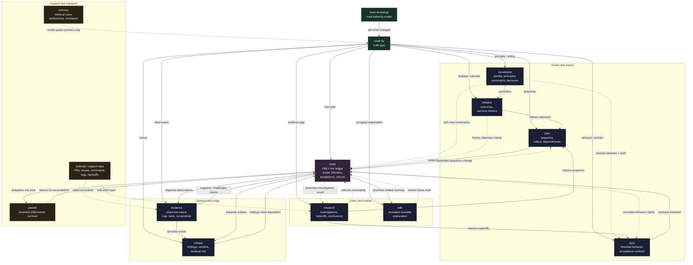

# Agent Loom

Treat your coding-agent sessions like cattle, not pets.


**Agent Loom makes the repo remember.**

Loom is repo-local **context integrity** for long-running agentic software work.

Coding agents do not act from "the whole project." They act from the context they can see or retrieve, the tools they can call, and the verification they can run. Long work degrades when critical information is trapped in chat, lossy summaries, stale plans, scratch files, or one precious session.

Loom turns the stable mechanics of agentic coding into a Markdown-native truth graph:

- agents need shaped, retrievable context
- work needs bounded units and explicit contracts
- durable state should outlive the active session
- verification has to be externalized as evidence
- fresh workers should be safe to start, stop, replace, and hand off
- human and agent judgment should be preserved where future workers can inspect it

The result is simple:

- every durable claim has one owning record
- every fresh worker receives a bounded packet, not vibes
- every task closes with evidence, critique, and promotion when needed

**The worker is disposable. The graph compounds.**

[Install Loom](INSTALL.md) · [Read the protocol](PROTOCOL.md) · [Architecture notes](ARCHITECTURE.md)

## Quick Navigation

| If you want to know... | Start here |
| --- | --- |
| What Loom is in one screen | [Loom At A Glance](#loom-at-a-glance) |
| Why agent work needs this | [The problem](#the-problem) · [The idea](#the-idea) · [When Loom pays rent](#when-loom-pays-rent) |
| How to try it quickly | [Try the cattle-not-pets demo](#try-the-cattle-not-pets-demo) |
| How to install it | [Install](#install) · [INSTALL.md](INSTALL.md) |
| How Loom decomposes work | [How Loom works](#how-loom-works) · [Project layers](#project-layers) · [How agents choose work](#how-agents-choose-work) |
| How execution and handoff work | [Outer loop](#outer-loop-shape-work) · [Inner loop](#inner-loop-run-clean-workers) · [Packets](#packets-compile-project-state) |
| How Loom decides work is done | [Done is a property of the graph](#done-is-a-property-of-the-graph) · [Evidence and trust boundaries](#evidence-and-trust-boundaries) |
| What ships in this repo | [What ships](#what-ships) · [Skill map](#skill-map) · [Repository layout](#repository-layout) |

<details>
<summary>Full table of contents</summary>

- [Loom At A Glance](#loom-at-a-glance)
- [The problem](#the-problem)
- [The idea](#the-idea)
- [Why Loom is model-shaped](#why-loom-is-model-shaped)
- [Try the cattle-not-pets demo](#try-the-cattle-not-pets-demo)
- [Install](#install)
- [When Loom pays rent](#when-loom-pays-rent)
- [How Loom works](#how-loom-works)
- [The core rule](#the-core-rule)
- [Project layers](#project-layers)
- [How agents choose work](#how-agents-choose-work)
- [Outer loop: shape work](#outer-loop-shape-work)
- [Inner loop: run clean workers](#inner-loop-run-clean-workers)
- [Packets compile project state](#packets-compile-project-state)
- [Done is a property of the graph](#done-is-a-property-of-the-graph)
- [Evidence and trust boundaries](#evidence-and-trust-boundaries)
- [Example: a bug fix through Loom](#example-a-bug-fix-through-loom)
- [Research is first-class](#research-is-first-class)
- [Workflows emerge from the vocabulary](#workflows-emerge-from-the-vocabulary)
- [How Loom relates to adjacent tools](#how-loom-relates-to-adjacent-tools)
- [Markdown, on purpose](#markdown-on-purpose)
- [What ships](#what-ships)
- [Skill map](#skill-map)
- [Repository layout](#repository-layout)
- [Costs](#costs)
- [The point](#the-point)

</details>

## Loom At A Glance

Read this as a noun/verb map, not an execution trace. The boxes are Loom nouns; the arrows are the verbs that keep agentic work decomposed into the right context owner. [Mermaid Live](https://mermaid.live/view#pako:eNqFVmtT4zYU_Ssa87FhN09IPJ2dKY_tUGAJjx22Lf2gyNeJFlnySnaAEv57jyQ7PMt-IVj3nqN7z33Y94kwGSVpkitzIxbcVuxi50ozJhR3bo9yZm40WZZLpdKN3na_Oxh0XGXNNaUb29l4NOl2hFHGpht5N9_KxTOsomy-Bg96_eGAr8Gz7nhIs3fAri5Lg3gius_7w972Gj2eTYYTeo5ujJsZd0jE8ruUjdjoGac1dUVtMluDfn_0k2Q8eufvq0QZU2zOjKngzstfZ_bjp8g1u4sKXSX_pGkaziLK1bM5XBfs89lvx_ug-Gx5QYzrjEldkc6A8H6MZdKSqKTR7OgsnuzCXRjtKlnV3hDukxlpHNx1WGmlFrJU5DrBElwtB63rsIyEdMC4GFEMLrAegFVqWUleySUFJMIVpmh5XC0EOccKqqwUrwnOp_s-MleSiBGFPChjM1rwpTQ20nCwlBXXghgiQ2CiekU1BU-peMzM0Y-a4N5pdFUKcflMSk-PVOllLF6-5yoffjm5BOcRcauDyHQLfqnfUfkM_pYcEGLR5LMkaD7n3q3RBOFnZPIcyiIZoeq3tfV338hr-UQA6GKpdnymotYhIB24_y-bC7BUUlxTFRAnX47-ZAq1agYpiiVMSR02UwZ-1r2UHGEq42pL8Y4IfKHVH1_3fvcdeTJzZJexJ7_XcHxHLO9PS9-DommdCM4YalWiXOFQmTmEqqAifpywRNotMDSv9Dr1HW7Ri6h8QOZSZ1J79JJsJkXVZIYCyazmilnprn_aBedfp9OTMy_jebM9fG6ooXb-6Z38poceVfK1-DNTh94WC6myzRtjofaLfm42VCQ43j8GQUGFsXdN5JgiWiJ0UbcTVlrKyXoNkailAkmjhm-w7X_z4dBtRVaD4eN6G2a84oFqegYK6ZznRlxFgUzd0yoscOAb9xX7WrYdtrn5aSUWxjiKW2zFLqJpN5raxeJW7KA5_oDzoI1bjz37hXl9VmFBeLeDgM79wnOs3TErNm1sniIjVBzWdudgRcvChfsxmQEvdW5s4dh6BB8veO7Q7o_mBu_Uhh-q9Rhpwz8NZmO9-KwtdEyhyf8ieGSkCNvAJ6GJOSXDHYeR4zD6oMy11es0mxtaGwLDLLA4LHGvrNi-99gPHk1ZHCqMt69SpOf0QozoOLdRc4shpJsVO33jlnagGutprEIzWEwTkswkBsFJH8iLXEtrCuNTdVRVWBvYOVilQK7Ypfe6jHUz6Gm8Z1heI216FC3QeAfBS29xLKut333gcS6kffbUS3Ercyz2J6Vpi9u48Ox77bN6Vl1vx6RFD8wwJHOsNP5NZH2V1F2r2reGpkYPgIf8axd7qgljbV6vMXz6yBzNEsqTdJK5lVmSAksdTLUtuH9M7j0YS3pBBbZlin8zbrGXrvQDMCXXf-FDoYWhZPNFkuZcOTzVJWaX9iTHqnp08W84u4vaVkk67AWKJL1PbpN0NPow6W9t46Op1-sOx73uqJPcJWl_sv1hPO4NR_3-YIQ_k-FDJ_k33NoFYDIYj0bD_nhrMtranjz8B4JHW70).



---

## The problem

Most agent workflows eventually create a junk drawer.

`PLAN.md` becomes the spec, todo list, research log, failed-attempt record, review trail, status update, and handoff summary. Scratch files litter the repo. The active chat becomes a pet: overloaded with volatile decisions, painful to abandon, and weirdly valuable because the repo does not know what happened.

When the work stops, resumes, compacts, switches models, switches harnesses, or hands off to another worker, the next agent has to infer what is still true.

The model did not just forget.

The project never knew.

Loom fixes that by giving each kind of truth a home.

## The idea

The active session is the wrong place for canonical project context.

A bigger context window lets an agent carry more state. Good compaction can preserve useful continuity. Loom is complementary: it moves durable state into repository records, so summaries can carry file paths, record IDs, and next actions while the full-fidelity truth stays in the repo.

Treating sessions like cattle, not pets, is not the doctrine. It is the consequence.

If the repo carries the important state, no single chat has to be preserved like a sacred object.

Once installed, Loom is meant to feel ambient. The skills teach the agent where durable information belongs, so ordinary coding work can flow into records without the user saying `use Loom` every turn.

A fresh worker should not inherit a giant transcript or a folklore summary. It should inherit:

- the relevant project records
- the current ticket
- the evidence so far
- the open critique
- the exact read and write scope
- the stop conditions
- the output contract

That compiled handoff is a **packet**.

The child does one bounded slice. The parent reconciles what happened. The repo keeps the memory.

```text
project state -> packet -> fresh worker -> evidence/critique -> reconciliation -> promoted learning -> better project state
```

## Why Loom is model-shaped

Loom is not just an agent-memory system. Memory is retrieval. Loom is context integrity.

Context integrity means the next worker can recover not only facts, but authority: what claim is canonical, what evidence supports it, what remains risky, what scope is allowed, and what still needs human or parent acceptance.

Loom is designed around properties that keep showing up across coding agents, models, and harnesses:

| Agentic principle | Loom expression |
| --- | --- |
| Agents act on visible or retrievable context | Project records make important state findable by file path, record ID, and typed links |
| Context windows are finite and can be polluted | Loom uses owner records and packets so workers get less context by volume and better context by shape |
| Compaction is useful but lossy | Compaction can preserve pointers while Loom preserves the full-fidelity records being pointed at |
| Long work needs bounded chunks | Tickets and packets define goal, read scope, write scope, source fingerprint, verification posture, stop conditions, and output contract |
| Fresh workers are a feature | Sessions can stop, resume, compact, switch models, switch harnesses, or hand off without losing the plot |
| Verification is the real reward signal | Evidence records preserve observed output, reproduction steps, logs, screenshots, scans, and test results |
| Human judgment moves upstream | Constitution, initiatives, specs, critique, and acceptance records preserve goals, constraints, tradeoffs, and decisions |

This is why Loom should age well.

It is not built around one model's current context size, one harness's command syntax, or one vendor's memory feature. It is built around the fact that agentic software work needs shaped context, bounded execution, externalized verification, and durable project truth.

---

## Try the cattle-not-pets demo

The fastest way to understand Loom is to stop protecting one precious agent session.

1. Start a nontrivial coding-agent task.
2. Let the work cross at least one ambiguity: a behavior question, failed attempt, review concern, research finding, partial implementation, or open risk.
3. Let the installed Loom skills place durable truth into owner records such as tickets, research, specs, evidence, critique, and wiki, with packets as bounded handoff support when needed.
4. Stop the session: close the chat, compact the context, switch models, switch harnesses, hand the work to another agent, or come back tomorrow.
5. Start from a fresh session and ask for the next step:

```text
Continue the active work from the repo's project records. Do not rely on prior chat context.
```

You usually should not need to say the magic words. If a harness or cold session does not route automatically, a nudge is fine:

```text
Use loom-bootstrap, then continue from the project records.
```

Without durable records, the new session usually guesses or tries to reconstruct the missing story.

With Loom, it should find the owner records, identify what is canonical, stay inside scope, continue from repo state, and preserve what changed.

Compaction is not the enemy. With Loom, compaction can carry high-value record paths and IDs while the records themselves preserve full-fidelity project truth.

That is the product: sessions can die; the project keeps the plot.

## Install

Loom installs as a skills package. The fastest path is to expose `skills/` to your coding harness.

```bash
git clone https://github.com/z3z1ma/agent-loom.git
```

First-class harness instructions are in [INSTALL.md](INSTALL.md):

- Claude Code
- OpenCode
- Codex
- Cursor
- Gemini CLI
- generic skills-directory install

After install, work normally. In a skills-aware harness, Loom should feel much like Superpowers: the agent discovers the bootstrap and downstream skills when the work calls for them.

Explicit prompts are escape hatches, not the main UX. They are still useful when you want to prod a cold session, force repair, or make the owner/workflow choice visible:

```text
Use loom-bootstrap, then continue from the project records.
```

```text
Use loom-records to inspect the graph and repair any broken links before continuing.
```

## When Loom pays rent

Loom is overkill for a one-line edit.

Use the source tree and Git when the work is tiny, local, and obvious.

Loom starts paying for itself when work crosses sessions, changes behavior, needs research, involves review, carries risk, requires handoff, prepares future work, or leaves behind knowledge the next worker would otherwise rediscover.

The principle is:

```text
minimum durable state, maximum recoverability
```

Reach for Loom when the cost of losing the plot is higher than the cost of keeping the graph honest.

---

## How Loom works

Loom has two loops.

The **outer loop** decides where truth belongs and shapes the next bounded move.
Its backbone is:

```text
constitution -> initiative -> plan -> ticket
```

Research and specs strengthen that backbone when evidence or intended behavior is missing. Evidence, critique, and wiki are follow-through routes for observations, review, and accepted explanation. Packets, memory, and saved support artifacts are support surfaces: packets carry bounded worker contracts, memory holds optional recall, and support artifacts help handoff audit or recovery without owning project truth.

The **inner loop** compiles a packet for a fresh worker:

```text
goal + read scope + write scope + source fingerprint + verification posture + stop conditions + output contract
```

The parent reconciles the worker result back into the graph.

No hidden database. No daemon. No SaaS. No special runtime required.

Just Markdown records the agent can read, write, diff, and review.

## The core rule

```text
placement beats recency
```

The newest chat message does not win. The longest summary does not win. The right record owns the claim.

For software work:

- the source tree owns implementation reality
- Git owns file history
- specs own intended behavior
- tickets own live execution state and acceptance
- evidence owns observed validation
- critique owns adversarial review and residual risk
- wiki owns accepted reusable explanation
- memory can support retrieval cues, preferences, and reminders without owning project truth

Memory can help the agent recover context. It does not become shadow truth. The project must remain truthful if memory is absent or stale.

## Project layers

Loom separates project state into canonical owner layers and durable support surfaces.

Canonical owner layers own project truth:

| Layer | What goes there |
| --- | --- |
| `constitution` | Durable identity, principles, hard constraints, precedent, roadmap direction |
| `initiative` | Strategic outcomes, success metrics, cross-cutting result framing |
| `research` | Investigations, tradeoffs, experiments, rejected paths, null results, evidence synthesis |
| `spec` | Intended behavior, requirements, scenarios, acceptance contracts |
| `plan` | Execution strategy, decomposition, sequencing, rollout |
| `ticket` | Live execution state, scoped work, blockers, acceptance disposition, closure |
| `evidence` | Observed artifacts, validation output, reproduction steps, logs, screenshots, scan results |
| `critique` | Adversarial findings, review verdicts, residual risk |
| `wiki` | Accepted explanation, architecture concepts, reusable workflow knowledge |

Durable support surfaces help execution and recovery without owning project truth:

| Surface | What goes there |
| --- | --- |
| `packet` | Bounded child-worker contracts; durable support, not project truth |
| `memory` | Optional support recall: retrieval cues, preferences, entities, reminders, and hot context |
| `support` | Optional, lazy-materialized saved support artifacts such as drive handoffs; not canonical truth |

Workspace and harness metadata, such as `.loom/workspace.md` and `.loom/harness.md`, are also support metadata: they help entry, owner selection, and environment recovery, but they do not own project truth.

The layers are ordinary Markdown records inside the repo. They are structured enough for agents to reason over and simple enough for humans to inspect.

## How agents choose work

The agent starts by asking one question:

**What kind of truth is this?**

Use this table as introductory orientation, not a token list to serialize into
records. Agents choose the next skill by reasoning over owner truth, tickets,
evidence, critique, plans, specs, and journals.

| Situation | Loom owner or workflow |
| --- | --- |
| Missing understanding | `research` |
| Unclear intended behavior | `spec` |
| Unclear sequencing | `plan` |
| Live scoped work | `ticket` |
| Observed output or validation | `evidence` |
| Review pressure, concern, or residual risk | `critique` |
| Stable accepted understanding | `wiki` |
| Bounded implementation pass | Ralph with a Ralph packet |
| Retrieval cue, preference, reminder, or hot context | Support recall; move it to the owning layer if it becomes durable truth |

A vague bug report becomes reproduction evidence, root-cause research, a tightened spec if behavior is ambiguous, a ticket for the fix, a Ralph packet for the implementation pass, green evidence, critique when risk warrants, and wiki promotion if the lesson should survive.

No new workflow was invented. The agent used the owner graph and skills.

## Outer loop: shape work

The outer loop shapes work before execution.

```text
constitution -> initiative -> plan -> ticket
```

Conditional gates keep the agent honest:

```text
need discovery or tradeoff analysis -> research
need behavior clarity -> spec
need sequencing -> plan
need bounded execution -> ticket
need observations -> evidence
need pressure-testing -> critique
need accepted explanation -> wiki
```

If a step cannot be completed honestly, route backward to the layer that can fix the gap.

Do not advance on vibes.

## Inner loop: run clean workers

The inner loop is Ralph-shaped:

```text
one packet
one fresh worker
one bounded mutation
one parent reconciliation
```

A parent compiles a packet, delegates one fresh-context execution step, receives a bounded outcome, and reconciles the result back into the graph.

The child handles one iteration. The packet defines the child contract. The ticket tracks live execution. The parent decides what became true.

Critique and wiki may reuse packet discipline, but their domain skills handle review and synthesis. They are sibling routes, not implementation passes pretending to be Ralph.

## Packets compile project state

A packet is a contract for a fresh worker.

A parent builds it from the upstream graph: relevant constitution records, initiative context, research, spec, plan, ticket, evidence, critique, source fingerprint, execution context, write scope, verification posture, stop conditions, and output contract.

The worker gets less context by volume, but better context by shape.

A strong packet states:

- the ticket or project record being served
- the bounded goal for this iteration
- what the worker may read
- what the worker may write
- the source fingerprint
- the Git branch or worktree context when files will change
- the verification posture
- stop conditions
- the output contract
- what the parent will do after return

Packets prevent context drift, hidden assumptions, uncontrolled changes, and scope creep.

A packet is not the project record. After the child returns, the parent reconciles the result into tickets, evidence, critique, research, specs, plans, wiki, constitution, or initiatives as needed; memory may retain support-only recall or pointers after owner truth is updated.

## Done is a property of the graph

Work is not done when the code compiles.

Work is done when the project is consistent.

For software work, closure usually requires:

- the relevant spec is satisfied, or ticket-local acceptance criteria are explicit
- evidence supports the claim being made
- critique is resolved, accepted, or recorded as residual risk
- the ticket reflects the actual final state
- durable learning has been promoted when it should survive the task

A child worker saying "done" is not enough. A commit is not enough. A green test is not enough if the ticket still lies.

**Done is a property of the graph.**

## Evidence and trust boundaries

The model can predict that work is done. It cannot make done true.

Loom makes verification explicit by separating claims from evidence and evidence from acceptance.

A strong evidence record should preserve enough detail for a future worker to inspect or reproduce the claim:

- command or procedure
- environment when relevant
- source fingerprint or commit
- expected result
- actual result
- exact output excerpt or artifact path
- screenshot, log, trace, scan, or test identity when useful
- whether the evidence supports, challenges, or only partially supports the claim

Loom also treats untrusted input as input, not truth.

External docs, web pages, generated files, tool output, and model-written summaries can inform research, evidence, critique, and tickets. They do not promote themselves into canonical truth. Promotion requires placement, judgment, and reconciliation through the owning layer.

## Example: a bug fix through Loom

A non-trivial bug fix usually follows this spine:

```text
route -> shape -> ready -> execute -> reconcile -> verify -> accept -> promote -> close
```

1. Capture reproduction evidence.
2. Research the root cause if it is unknown.
3. Update or create a spec if intended behavior is fuzzy.
4. Create or tighten the ticket.
5. Compile a Ralph packet for one implementation pass.
6. Run a fresh worker.
7. Record red and green evidence.
8. Route critique when risk warrants.
9. Accept only when the ticket reflects reality.
10. Promote durable learning into research, wiki, spec, plan, initiative, constitution, or evidence; leave support-only recall, reminders, preferences, or owner-record pointers in memory when useful.
11. Close when the graph is consistent.

The same pattern works for features, spikes, reviews, refactors, migrations, codebase mapping, and release preparation.

## Research is first-class

A lot of software work is knowledge work before it is code.

Agents explore libraries, inspect implementation paths, test approaches, compare options, discover constraints, and learn that something does not work. If that work stays in scratch files or short-lived context, the next session repeats it.

Research gives that work a durable place: questions, options, experiments, rejected approaches, null results, supporting evidence, open questions, and evidence-grounded recommendations.

A failed path can be valuable. A null result can be the most important thing the project learned that day.

This is where Loom crosses from coding workflow into knowledge-work protocol.

## Workflows emerge from the vocabulary

Workflow skills coordinate work through existing owner layers. They do not create ledgers or new owner layers.

```text
brainstorm:
workspace problem shaping -> research/spec as needed -> plan -> ticket

test-first implementation:
ticket -> Ralph packet with verification_posture:test-first -> red evidence -> green evidence -> ticket acceptance

debug:
evidence -> root-cause research -> spec if needed -> ticket -> local_edit or Ralph packet -> evidence -> critique -> retrospective

spike:
research -> throwaway scope if needed -> evidence -> conclusions/null results -> downstream spec, plan, ticket, or wiki

code map:
scan evidence -> research where structure is uncertain -> wiki atlas when accepted

review:
critique -> evidence -> ticket reconciliation -> acceptance or repair

parallel execution:
plan execution waves -> non-overlapping tickets/Ralph packets/worktrees -> child results -> parent integration evidence -> reconciliation

git isolation:
ticket/Ralph packet scope -> explicit baseline -> branch/worktree -> diff provenance -> handoff evidence

implementation:
ticket -> Ralph packet -> worker -> evidence -> reconcile

ship:
ticket/evidence/critique/promotion disposition -> PR summary, release note, risk summary, follow-up list

retrospective:
ticket or initiative lessons -> wiki, research, spec, plan, initiative, constitution, or evidence; memory cleanup may leave support-only recall or pointers
```

You do not invent a workflow every time. You route through the project graph.

## How Loom relates to adjacent tools

Loom is not trying to replace every agent workflow project.

It is the source-of-truth layer underneath long-running agent work.

| Project | Primary contribution | How Loom differs |
| --- | --- | --- |
| Superpowers | Better agent habits and explicit development skills | Loom focuses on where durable truth lives after those habits run |
| GSD | Context engineering and workflow acceleration | Loom focuses on project-state integrity, owner layers, and reconciliation |
| Spec Kit | Specs as central implementation drivers | Loom treats specs as one owner layer among research, tickets, evidence, critique, and wiki |
| Beads | Local agent-facing task graph | Loom includes tickets, but broadens the graph to behavior, research, validation, review, and durable knowledge |
| Ralph | Fresh-context workers and restartable bounded loops | Loom turns that loop into packet, child worker, evidence, and parent reconciliation |

The short version:

```text
Superpowers: better agent habits
Beads: task graph
Spec Kit: executable specs
GSD: workflow/context harness
Ralph: clean worker loop
Loom: repo-local context integrity
```

You can run other tools beside Loom. Loom's job is to make sure the project knows what became true.

Because Loom is delivered as skills, it should usually feel like an ambient operating vocabulary rather than a command line the user has to remember.

## Markdown, on purpose

Loom is Markdown-native.

No service. No daemon. No hidden runtime database.

The graph is files. Agents already know how to search with `rg`, traverse with `find`, inspect with `cat`, compare with `git diff`, edit records, move files, and compose shell tools with `awk`, `sed`, `xargs`, and pipes.

That is enough.

Optional utilities may validate, project, or summarize state. They do not define Loom semantics.

Harness adapters may preload bootstrap references where a harness supports it cleanly. That is an adapter optimization over the same skill package, not a second doctrine source.

The protocol is the corpus.

---

## What ships

This repository ships the Loom skill package.

The package product surface is the top-level `skills/` corpus. Support docs, harness manifests/adapters, examples, packaging files, packets, memory, and saved support artifacts may explain, transport, validate, or recover Loom work; they do not own protocol truth.

It is not a runtime, service, daemon, MCP server, product CLI, workflow engine, hidden database, or prompt dump.

Included:

- `skills/`, the package product surface and canonical Loom skill corpus
- `loom-bootstrap`, the entry skill that anchors the rest of the package
- project-owner skills for constitution, initiatives, research, specs, plans, tickets, evidence, critique, and wiki
- the `loom-memory` support skill for optional recall without shadow truth
- workflow skills for workspace entry, records, `loom-drive` objective/workflow driving, Ralph, Git, debugging, spike, codemap, ship, retrospective, and skill authoring
- templates and references for Markdown-native operation
- harness manifests and adapters as install/transport support, not doctrine sources
- `PROTOCOL.md`, the stable protocol summary, not a separate product surface
- `ARCHITECTURE.md`, implementation and package architecture notes for maintainers
- packaging files and repository metadata for distribution and maintainer workflows
- internal examples and fixtures for maintainer review, not product-surface guidance or protocol truth

The product surface is `skills/`: the skills are the protocol in operational form.

## Skill map

| Skill | Role |
| --- | --- |
| `loom-bootstrap` | Entry doctrine and Loom operating posture; usually reached automatically through skills |
| `loom-workspace` | Workspace entry, structure check, first owner/workflow decision |
| `loom-records` | IDs, frontmatter, typed links, status, validation, repair |
| `loom-constitution` | Project identity, constraints, decisions, roadmap direction |
| `loom-initiatives` | Strategic outcomes and success framing |
| `loom-research` | Reusable discovery, experiments, tradeoffs, null results |
| `loom-specs` | Intended behavior and acceptance contracts |
| `loom-plans` | Sequencing, decomposition, rollout strategy |
| `loom-tickets` | Live execution ledger and acceptance gate |
| `loom-evidence` | Observed artifacts and claim support or challenge |
| `loom-critique` | Adversarial review, findings, verdicts, residual risk |
| `loom-wiki` | Accepted explanation and reusable understanding |
| `loom-memory` | Support recall, retrieval cues, preferences, and reminders without shadow truth |
| `loom-drive` | Objective and workflow coordination that routes work through owner layers without owning project truth |
| `loom-ralph` | Bounded fresh-context implementation loop |
| `loom-git` | Implementation isolation, baseline, branch/worktree provenance |
| `loom-debugging` | Reproduce-first debug workflow through existing layers |
| `loom-spike` | Bounded investigation and sketch workflow through research and evidence |
| `loom-codemap` | Repository atlas workflow through evidence, research, and wiki |
| `loom-ship` | PR, release, handoff, risk, and follow-up packaging |
| `loom-retrospective` | Compounding pass that promotes accepted learning into project layers |
| `loom-skill-authoring` | Maintaining Loom-compatible skills without breaking the protocol |

## Repository layout

```text
.
├── README.md
├── INSTALL.md
├── PROTOCOL.md
├── ARCHITECTURE.md
├── AGENTS.md
├── examples/             # internal fixtures and traces, not product surface or project records
├── optional-utilities/   # helpers that do not define semantics
└── skills/               # canonical Loom skill package
```

Inside a Loom-enabled project, the runtime tree looks roughly like this:

```text
.loom/
├── workspace.md        # optional workspace metadata; support, not project truth
├── harness.md          # optional harness metadata; support, not project truth
├── constitution/
│   ├── constitution.md
│   ├── decisions/
│   └── roadmap/
├── initiatives/
├── research/
├── specs/
├── plans/
├── tickets/
├── critique/
├── wiki/
├── packets/
│   ├── ralph/
│   ├── critique/
│   └── wiki/
├── evidence/
├── memory/        # optional support recall
│   ├── system/
│   └── user/
└── support/       # optional saved support artifacts; non-canonical
    └── drive-handoffs/
```

First records usually emerge through `loom-workspace`, `loom-constitution`, and `loom-tickets`.

---

## Costs

Loom asks for discipline.

Broken links matter. Stale records matter. Evidence that overclaims matters. A ticket that says the work is accepted when critique is unresolved is worse than no ticket at all.

Loom also has a threshold. Do not create a graph-shaped shrine around a one-line edit.

The graph pays for itself when work crosses sessions, changes behavior, needs review, involves research, carries risk, requires handoff, prepares future work, or leaves behind knowledge the next worker would otherwise rediscover.

The failure mode to guard against is a second junk drawer.

Loom only works when records stay small enough to inspect, linked enough to recover, and honest enough that a future worker can trust them.

## The point

Loom is not a bigger prompt.

It is not a memory feature.

It is not a way to keep one agent session alive forever.

Loom is a repo-local context-integrity layer for agentic software work.

It keeps AI work from scattering across chat, plan files, tool state, and stale scratchpads. It gives agents a vocabulary for placing work where it belongs. It gives projects a memory that survives stopped sessions, context compaction, model switches, worker handoff, and time.

Compaction can preserve a pointer. Loom preserves the thing being pointed at.

The pieces already existed. Loom gives each one a job.

```text
the work stops drifting
the agent stops carrying everything
the project starts remembering
```
